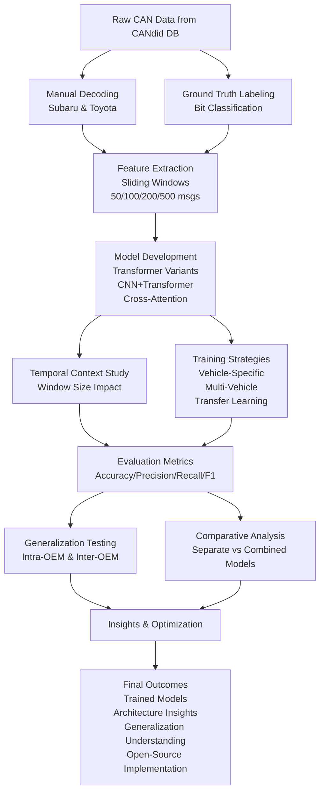

# CAN Reverse Engineering Project Plan - 2026

## Refined Research Objectives

### Primary Objective
Develop transformer-based models capable of automatically classifying each bit (64-bit resolution) in CAN messages according to its functional data type (counter, checksum, sensor data, flag bit, etc.).

### Secondary Objectives

#### 1. Architecture Optimization & Comparison
- Evaluate multiple transformer architectures with varying:
  - Temporal input sizes (sliding windows of 50, 100, 200, 500 consecutive messages)
  - Integration of CNN layers for local feature extraction
  - Different attention mechanisms (self-attention, cross-attention variants)
  - Positional encoding strategies
- Determine optimal architectural configurations for bit-level CAN message classification

#### 2. Vehicle-Specific Model Development
- Manually decode CAN message IDs for Subaru and Toyota vehicles as initial test cases
- Create labeled datasets from decoded CAN messages (using CANdid message DB from 6 vehicles)
- Leverage open-source OBD reference materials to bootstrap message decoding
- Train and validate models separately for each vehicle model to establish baseline performance

#### 3. Generalization & Transfer Learning Analysis
- Test model generalization capabilities:
  - Across different vehicles from the same OEM (intra-OEM generalization)
  - Across vehicles from different OEMs (inter-OEM generalization)
- Quantify performance degradation when applying models to unseen vehicles/OEMs
- Investigate fine-tuning strategies for adapting models to new vehicle platforms

#### 4. Combined vs. Separate Model Comparison
- Develop unified training approaches using multi-vehicle, multi-OEM datasets
- Compare performance of:
  - Models trained separately on individual vehicles/OEMs
  - Models trained on combined datasets from multiple vehicles/OEMs
- Analyze trade-offs between model specialization and generalization capability
- Determine conditions under which combined models outperform vehicle-specific approaches

### Success Criteria
- Achieve >90% accuracy in bit-level classification for known message types
- Demonstrate measurable generalization capability across vehicle platforms
- Provide insights into which architectural choices work best for CAN bit classification
- Establish baseline performance benchmarks for future research in this area

## Experimental Setup

### Experiment Diagram

### Data Collection & Preparation
1. **Source Data**: Utilize CANdid message DB containing recordings from 6 vehicles
2. **Initial Focus**: Manual decoding of CAN message IDs for Subaru and Toyota vehicles
3. **Reference Materials**: Leverage open-source OBD reference work to assist in message decoding
4. **Labeling**: Create ground truth labels for each bit in 64-bit CAN messages:
   - Counter bits
   - Checksum bits
   - Sensor data bits
   - Flag bits
   - Other functional bit types

### Model Development
1. **Transformer Architectures to Test**:
   - Standard transformer encoders
   - Transformer with integrated CNN layers
   - Cross-attention mechanisms
   - Variants with different positional encoding approaches

2. **Temporal Context Variations**:
   - Sliding window sizes: 50, 100, 200, 500 consecutive messages
   - Investigate impact of temporal context on bit classification performance

3. **Training Strategies**:
   - Initial training on individual vehicle models (Subaru, Toyota separately)
   - Combined training on multi-vehicle, multi-OEM datasets
   - Transfer learning approaches between vehicle platforms

### Evaluation Methodology
1. **Primary Evaluation**:
   - Bit-level classification accuracy against ground truth labels
   - Precision, recall, and F1 scores for each bit type category

2. **Generalization Testing**:
   - Evaluate models trained on one vehicle/OEM on different vehicles from same OEM
   - Evaluate models trained on one OEM on vehicles from different OEMs
   - Measure performance degradation and identify generalization limits

3. **Comparative Analysis**:
   - Compare performance of vehicle-specific vs. combined models
   - Analyze impact of architectural choices on classification performance
   - Determine optimal temporal window sizes for different bit types

### Implementation Tools & Technologies
- **Programming Language**: Python
- **Deep Learning Framework**: PyTorch or TensorFlow
- **CAN Libraries**: python-can, cantools
- **Data Processing**: NumPy, Pandas
- **Visualization**: Matplotlib, Seaborn, Plotly
- **Experiment Tracking**: Weights & Biases or TensorBoard
- **Version Control**: Git

### Timeline (2026)
- **Q1 (Jan-Mar)**: Data collection, initial decoding, baseline model development
- **Q2 (Apr-Jun)**: Architecture experimentation, temporal context studies
- **Q3 (Jul-Sep)**: Generalization testing, combined model approaches
- **Q4 (Oct-Dec)**: Comparative analysis, optimization, documentation, final reporting

### Expected Outcomes
1. Trained transformer models capable of bit-level CAN message classification
2. Insights into effective architectural choices for CAN bit classification
3. Understanding of model generalization capabilities across vehicle platforms
4. Comparative analysis of vehicle-specific vs. combined modeling approaches
5. Open-source implementation and documentation for reproducibility

---
*This plan represents a comprehensive approach to applying deep learning techniques for automatic classification of functional bit types in CAN bus communications, with applications in vehicle diagnostics, security research, and automotive innovation.*