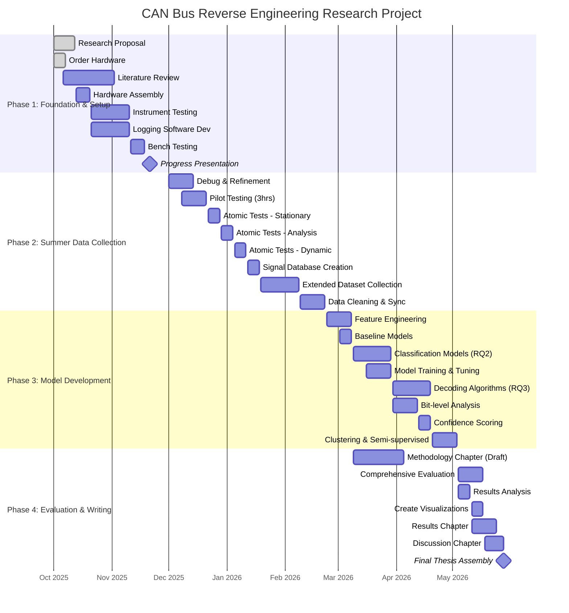

# CAN_Reverse_Engineer_Project

```mermaid
gantt
    title CAN Bus Reverse Engineering Research Project
    dateFormat  YYYY-MM-DD
    axisFormat  %b %Y
    section Phase 1: Foundation & Setup
    Research Proposal           :done, rp, 2025-10-01, 2025-10-12
    Order Hardware              :done, oh, 2025-10-01, 2025-10-07
    Literature Review           :lr, 2025-10-06, 2025-11-02
    Hardware Assembly           :ha, 2025-10-13, 2025-10-20
    Instrument Testing          :it, 2025-10-21, 2025-11-10
    Logging Software Dev        :ls, 2025-10-21, 2025-11-10
    Bench Testing               :bt, 2025-11-11, 2025-11-18
    Progress Presentation       :milestone, pp, 2025-11-19, 2025-11-23

    section Phase 2: Summer Data Collection
    Debug & Refinement          :dr, 2025-12-01, 2025-12-14
    Pilot Testing (3hrs)        :pt, 2025-12-08, 2025-12-21
    Atomic Tests - Stationary   :as, 2025-12-22, 2025-12-28
    Atomic Tests - Analysis     :aa, 2025-12-29, 2026-01-04
    Atomic Tests - Dynamic      :ad, 2026-01-05, 2026-01-11
    Signal Database Creation    :sd, 2026-01-12, 2026-01-18
    Extended Dataset Collection :ed, 2026-01-19, 2026-02-08
    Data Cleaning & Sync        :dc, 2026-02-09, 2026-02-22

    section Phase 3: Model Development
    Feature Engineering         :fe, 2026-02-23, 2026-03-08
    Baseline Models             :bm, 2026-03-02, 2026-03-08
    Classification Models (RQ2) :cm, 2026-03-09, 2026-03-29
    Model Training & Tuning     :mt, 2026-03-16, 2026-03-29
    Decoding Algorithms (RQ3)   :da, 2026-03-30, 2026-04-19
    Bit-level Analysis          :ba, 2026-03-30, 2026-04-12
    Confidence Scoring          :cs, 2026-04-13, 2026-04-19
    Clustering & Semi-supervised:cl, 2026-04-20, 2026-05-03

    section Phase 4: Evaluation & Writing
    Methodology Chapter (Draft) :mc, 2026-03-09, 2026-04-05
    Comprehensive Evaluation    :ce, 2026-05-04, 2026-05-17
    Results Analysis            :ra, 2026-05-04, 2026-05-10
    Create Visualizations       :cv, 2026-05-11, 2026-05-17
    Results Chapter             :rc, 2026-05-11, 2026-05-24
    Discussion Chapter          :dc, 2026-05-18, 2026-05-28
    Final Thesis Assembly       :milestone, fta, 2026-05-25, 2026-05-31
```
