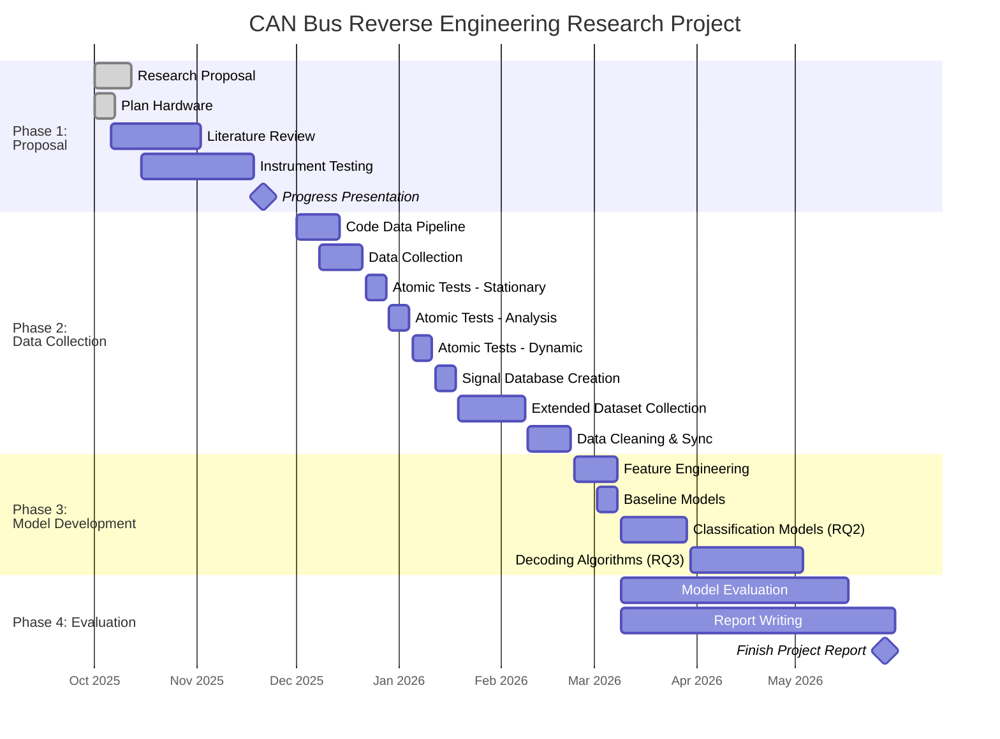

# CAN_Reverse_Engineer_Project

```mermaid
gantt
    title CAN Bus Reverse Engineering Research Project
    dateFormat  YYYY-MM-DD
    axisFormat  %b %Y
    tickInterval 1month
    section Phase 1:<br>Proposal
    Research Proposal           :done, rp, 2025-10-01, 2025-10-12
    Plan Hardware               :done, oh, 2025-10-01, 2025-10-07
    Literature Review           :lr, 2025-10-06, 2025-11-02
    Instrument Testing          :it, 2025-10-15, 2025-11-18
    Progress Presentation       :milestone, pp, 2025-11-19, 2025-11-23

    section Phase 2:<br>Data Collection
    Code Data Pipeline          :dp, 2025-12-01, 2025-12-14
    Data Collection             :pt, 2025-12-08, 2025-12-21
    Atomic Tests - Stationary   :as, 2025-12-22, 2025-12-28
    Atomic Tests - Analysis     :aa, 2025-12-29, 2026-01-04
    Atomic Tests - Dynamic      :ad, 2026-01-05, 2026-01-11
    Signal Database Creation    :sd, 2026-01-12, 2026-01-18
    Extended Dataset Collection :ed, 2026-01-19, 2026-02-08
    Data Cleaning & Sync        :dc, 2026-02-09, 2026-02-22

    section Phase 3:<br>Model Development
    Feature Engineering         :fe, 2026-02-23, 2026-03-08
    Baseline Models             :bm, 2026-03-02, 2026-03-08
    Classification Models (RQ2) :cm, 2026-03-09, 2026-03-29
    Decoding Algorithms (RQ3)   :da, 2026-03-30, 2026-05-03

    section Phase 4: Evaluation
    Model Evaluation            :ce, 2026-03-09, 2026-05-17
    Report Writing              :wr, 2026-03-09, 2026-05-31
    Finish Project Report       :milestone, fta, 2026-05-25, 2026-05-31
```
