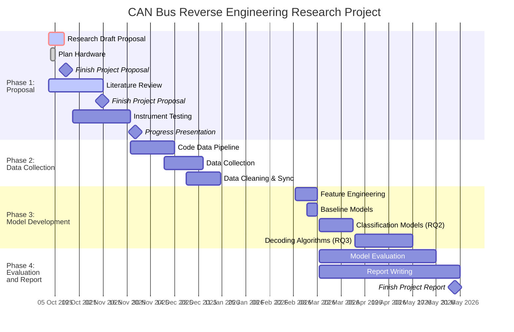

# CAN_Reverse_Engineer_Project

## Research Objectives
Develop and validate a multi-modal data collection and semi-automated labeling framework that reduces manual effort in CAN bus reverse engineering by enabling systematic identification and decoding of common vehicle signals.

Create a high-quality, synchronized multi-modal dataset combining CAN bus logs, timestamped video, periodic OBD-II messages, GPS data, and IMU measurements for automotive reverse engineering research
Develop machine learning models that can classify CAN message types and decode signal values for labeled message classes with measurable confidence metrics

## Research Questions
RQ1: Data Collection & Labeling Framework
How effectively can multi-modal sensor data (GPS, IMU, OBD-II) be used to automatically generate labeled training data for CAN bus signals?

RQ2: Automated Signal Classification
To what extent can machine learning models accurately classify CAN message IDs to their corresponding vehicle signals using semi-automatically labeled training data?

RQ3: Signal Decoding Automation
Primary: How accurately can signal encoding parameters (byte position, endianness, scaling, offset) be automatically extracted for classified CAN messages?

## Gantt Chart

