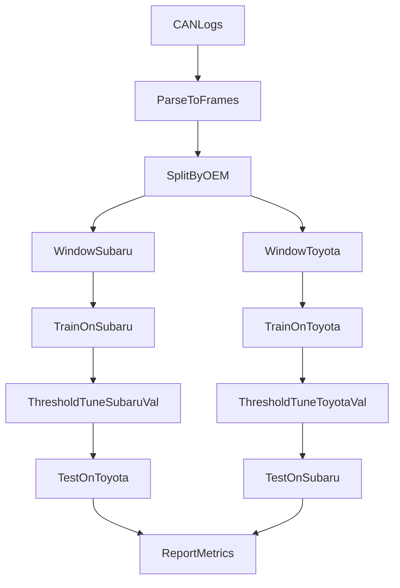

## Goal

Build a research loop that tests **different Transformer-type model families/structures** for **bit-level role detection** on CAN payload bits, and demonstrates **generalization across manufacturers** using **Subaru↔Toyota leave-one-OEM-out** evaluation.

## Working definitions (so evaluation is unambiguous)

- **Input**: for a given CAN ID, a time window of payloads represented as either raw bits or bit-diffs.
- **Output (bit-level)**: for each of the 64 bit positions, predict a 4-dim multi-label vector (CHECKSUM/COUNTER/SENSOR/FLAG) or a mutually-exclusive variant if you decide to force exclusivity later.
- **OEM generalization**: train on Subaru windows (all IDs), test on Toyota windows (all IDs), and vice versa.

## Dataset construction (prevent leakage)

- **Split by OEM first**: ensure no windows from Toyota appear in training when Toyota is the held-out test set.
- **Group by CAN ID** within OEM for reporting: produce metrics per-ID and aggregated across IDs.
- **Windowing**:
  - Evaluate multiple window sizes: {50, 100, 200, 500} frames.
  - Evaluate multiple strides: {5, 10, 25}.
- **Representations** (treat as experimental factors):
  - `raw`: raw bit values.
  - `diff`: XOR successive frames (your current approach).
  - `both`: concatenate raw and diff as channels.
  - Optional: per-bit derived features per window (toggle-count, autocorr peak, entropy) to feed as extra channels.
- **Labeling for bit-level**:
  - Convert your current CAN-ID label_map into bit labels by adding a labeling protocol:
    - **Manual bit annotations** for a small set of IDs per OEM (seed set).
    - Expand via heuristics (e.g., counter candidate bits = high toggle rate + low entropy of increments when interpreted as nibble) then validate manually.
  - Keep a strict separation: annotations derived from Toyota must not influence Subaru-only training runs (and vice versa) for the OEM-holdout benchmark.

## Baselines (must beat)

- **Heuristic baselines** (strong and interpretable):
  - Counter detector: toggle-rate + periodicity / modulo pattern test on bit groups (nibble/byte).
  - Checksum detector: correlation with other bits/bytes + high sensitivity to payload changes.
  - Flag detector: sparse toggles + high mutual information with discrete events.
- **Non-Transformer ML**:
  - Per-bit 1D CNN classifier (like your `PureInvariantClassifier` idea but output per-bit labels).
  - Temporal convolution network (TCN) per bit.

## Transformer-style model families to test

Treat these as a matrix of design choices; keep parameter counts roughly comparable.

### A) Tokenization choices (what is a token?)

- **Bit-token**: 64 tokens; each token’s features come from its time history (your `TemporalBitTransformer` family).
- **Byte-token**: 8 tokens; each token is 8-bit vector over time (lets model learn byte-level structure).
- **Time-token**: 50–500 tokens; each token is the 64-bit payload at that timestep (classic sequence modeling).
- **Hybrid / hierarchical**:
  - Local temporal encoder per bit/byte (CNN/SSM) → token embedding → Transformer across bits/bytes.

### B) Temporal encoder choices (within-token time processing)

- **Linear projection** (current `TemporalBitTransformer`): simplest, phase-sensitive.
- **CNN** (current `InvariantBitClassifier` idea): more shift/phase invariance.
- **SSM** (state-space) encoders: e.g., Mamba-style blocks or S4-style layers (often strong for long windows).

### C) Attention variants (Transformer type)

- **Vanilla MHA** encoder.
- **Linear attention / Performer-style** (scale to large windows if using time-tokens).
- **Local attention** (restrict to neighborhoods in time or bit index).
- **Cross-attention** architectures:
  - Bit-queries attend over time (or vice versa) to explicitly localize temporal evidence.

### D) Inductive bias / invariances (key for OEM generalization)

- **Bit identity embeddings**: on/off (your `NoPosBitTransformer` ablation).
- **Permutation-invariant bit set**: remove bit position embeddings but add structure via grouping (byte grouping) to see what generalizes.
- **Relative positional encodings in time** (helps phase invariance).
- **Multi-scale windows**: combine features from multiple window lengths.

## Evaluation: proving generalization

Use metrics that reflect bit-level quality and avoid being dominated by easy negatives.

- **Per-bit metrics** (primary):
  - AUROC / AUPRC per class (CHECKSUM/COUNTER/SENSOR/FLAG).
  - F1 at tuned thresholds (tune thresholds on Subaru-val only; apply fixed on Toyota-test).
- **Per-ID aggregation**:
  - For each CAN ID, compute per-bit F1/AUPRC; then macro-average across IDs.
- **OEM-holdout protocol**:
  - Run 2 directions:
    - Train Subaru → Test Toyota
    - Train Toyota → Test Subaru
  - Within training OEM, use a validation split by CAN ID (or by drive segment) to tune thresholds and early stopping.
- **Robustness checks**:
  - Evaluate at multiple window sizes and confirm the chosen model doesn’t collapse when window changes.
  - Evaluate under synthetic noise: bit flips, dropped frames, random time shifts.

## Error analysis loop (what to inspect every run)

- **Calibration**: reliability curves per class, per OEM.
- **Confusions**: which bits become false counter/false checksum under OEM shift.
- **Attribution**:
  - For time-token models: attention rollout or gradient saliency over time.
  - For bit-token models: which bits attend to which others.
- **Qualitative “bit inspector”** (extend your `inspect_bits` idea): top-k candidate bits per role per ID, with their temporal traces.

## Recommended minimal experiment set (to start)

Keep it small but informative before expanding:

1. Bit-token + linear temporal projection + vanilla encoder (your `TemporalBitTransformer` baseline).
2. Bit-token + CNN temporal encoder + shallow encoder (your `InvariantBitClassifier` baseline).
3. Time-token model: Transformer encoder over timesteps with lightweight embedding of 64-bit payload.
4. Ablations:
  - remove bit positional embeddings (`NoPosBitTransformer` style)
  - raw vs diff vs both
  - window_size sweep

## Success criteria (what would convince you it generalizes)

- On OEM-holdout, the best model beats heuristics and CNN baselines on **AUPRC/F1 for COUNTER and CHECKSUM** (hardest roles), not just SENSOR.
- Performance is stable across window sizes (no brittle dependence on 50 frames).
- Error analysis shows consistent bit-localization patterns across OEMs (not “always predicting sensor”).

## Suggested notebook/code organization

- Keep the experimentation in notebooks but factor shared code into a small module:
  - `Research/can_data.py`: parsing, windowing, representations, split logic.
  - `Research/models/`: model variants + common heads.
  - `Research/eval.py`: metrics, threshold tuning, OEM-holdout runner.
  This reduces accidental leakage and makes ablations systematic.

## Experimental design diagram

